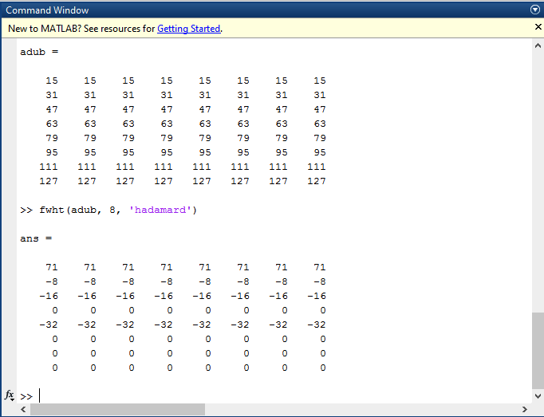
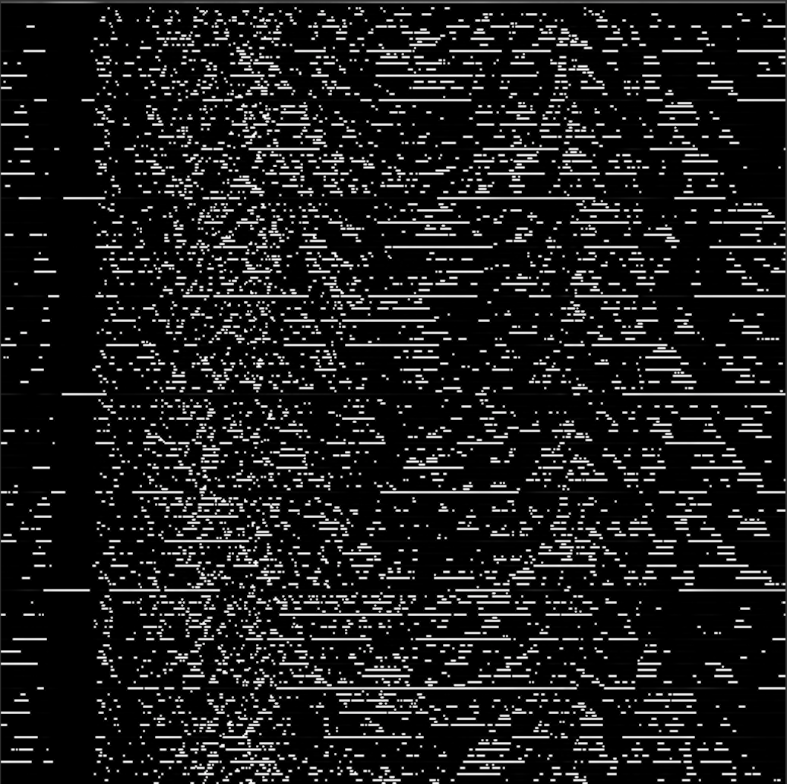
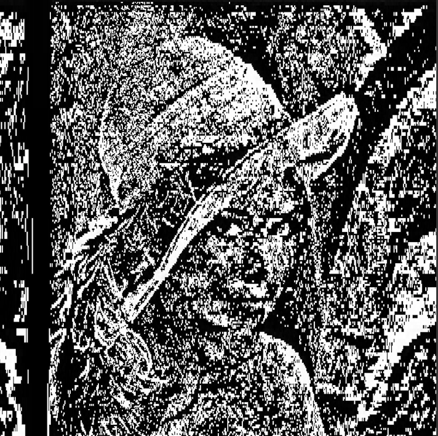
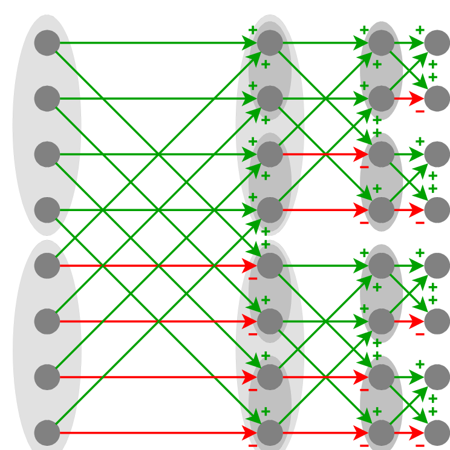

# FWHT2

Fast Walsh–Hadamard transform

## Command

You can perform the Fast Walsh–Hadamard transform by using the command `./img.exe fwht2 imgin.pgm imgout.pgm`. This will perform the same operation that fwht(Matrix, Matrix_Size, 'hadamard') in matlab would perform.

### MatLab Output



### UIA Output

#### Input Image


#### Output Image


## Image Loss

### Orignal Image


### First Transformation Performed



### Second Transformation Performed



## Code

```c
        for(int col = 0; col < cols3; ++col)
	    {
            double buffer[cols3];
            for(int row = 0; row < rows3; ++row)
            {
                buffer[row] = *(img_array1 + row*rows3 + col);
            }

            double* fwht = fwhtOneD(buffer, cols3);
            for(int row = 0; row < rows3; ++row)
            {
                *(img_array3 + row*rows3 + col) = (fwht[row])/rows3;
            }
        }
```


